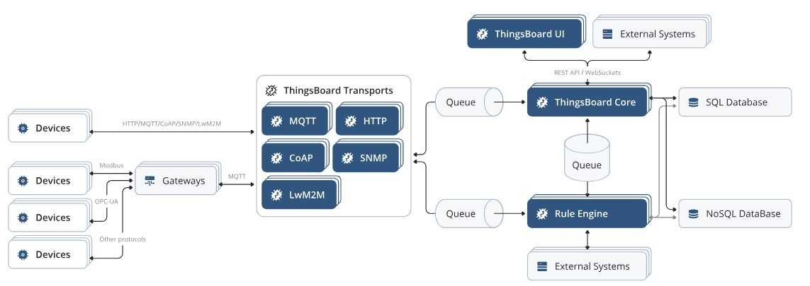
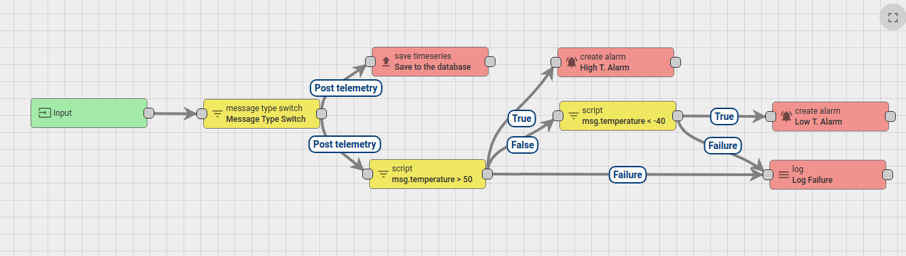
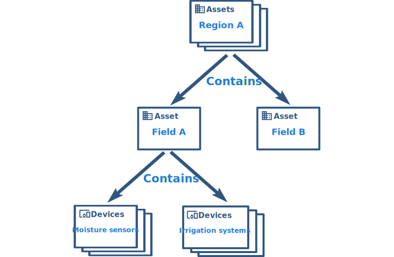

# ThingsBoard

## Cos'è
ThingsBoard è la piattaforma scelta per la raccolta dati delle varie arnie. Tale software dovrà essere configurato sul server prescelto per poter poi usufruire delle informazioni salvate
Il server configurato potrà disporre anche di un'interfaccia predefinita per mostrare i dati raccolti, selezionando quali e come esporli. 

**N.B.** *Dal momento che rientra tra i progetti della scuola realizzare l'interfaccia grafica per i dati dell'alveare, questa relazione affronterà solo il punto di vista tecnico del server, approfondendo cosa è utile per interagire con esso e inserire/estrapolare dati.*

## Architettura della piattaforma

L'architettura di ThingsBoard è costituita da vari elementi, di seguito riportiamo i principali. 

### Core
Il ***Core*** di ThingsBoard è come dice, il nome, la parte centrale della piattaforma. Essa serve a:
- Gestire le chiamate API da altri dispositivi
- Agire su attributi e dati di telemetria
- Processare messaggi provenienti da [*Rule engine*](#rule-engine)
- Monitorare lo stato di connettività (attivo/disattivo)

### Rule engine
Il ***Rule engine*** è una parte di ThingsBoard che stabilisce le regole, le condizioni e le azioni da compiere per uno specifico dato. È possibile eseguire confronti, stabilire se salvare o meno il dato o lanciare degli allarmi.

Il rule engine è costituito dai seguenti elementi:
- **Message** è qualsiasi evento. Può essere un dato come una richiesta, una chiamata API ecc.
- **Rule node** funzione che agisce su un messaggio, quindi può compiere trasformazioni, lavorazioni del dato ecc.
- **Rule chain** connessione tra nodi che permette di trasferire l'output di un nodo come input di un altro. 

*Esempio di rule engine configutarabile in ThingsBoard*

#### Linguaggio per Rule Node
Il linguaggio utilizzato per il *Rule Node* è:
- **TBEL** linguaggio di ThingsBoard con struttura java-like
- **Javascript** linguaggio java-like maggiormente conosciuto e compatibile per i nodi di ThingsBoard

#### Tipi predefiniti di messaggi
Esistono dei tipi predefiniti di messaggi intercettabili configurati in ThingsBoard raggiungibili tramite [questo link](https://thingsboard.io/docs/user-guide/rule-engine-2-0/overview/#predefined-message-types).

### Database
Tutti i dati inviati su ThingsBoard vengono salvati nei database, che contengono:
- **entities** come dispositivi, clienti, dashboard, ecc. Contengono quindi la parte di configurazione dell'ambiente ThinhsBoard. 
- **telemetries** rilevazioni sensori, tempi, statistiche, eventi. 

Tali informazioni possono essere salvate attraverso due tipi di database:
- **SQL** di default. Viene consigliato l'utilizzo di PostgreSQL in quanto viene ampiamente supportato da ThingsBoard.
- **Ibridi** salvando le *entities* in PostgreSQL e i dati dei sensori utilizzando Cassandra o TimescaleDB. 

## Entità e relazioni
### Tipologie di entità
Come è possibile vedere nella parte precedente, ThingsBoard contiene una serie di entità utili al funzionamento della piattaforma. Essi sono:
- **Tenant** profilo che identifica un singolo o un'organizzazione che compra o possiede dispositivi e asset. Associato al tenant possiamo avere una serie di clienti che possono visualizzare quanto predisposto dal tenant. 
- **Customer** profilo che consente l'accesso in visualizzazione ai dispositivi già configurati dal Tenant. Un cliente può quindi avere più utenti che può creare e più dispositivi e asset da visualizzare. 
- **User** profilo che accede solo a dashboard e gestisce entità.
- **Dispositivi** entità che producono dati in telemetria e che gestiscono comandi RPC.
- **Asset** entità astratte che possono essere collegate a dispositivi o altri asset *(veicolo, campo, ecc.)*
- **Entity View** da configurare se si vuole far visualizzare solo una parte di dispositivi e asset al profilo Costumer.
- **Alarms** eventi che notificano problemi / informazioni con dispositivi, asset o entità.
- **Dashboard** visualizzazione dei dispositivi IoT per la loro configurazione e la costruzione dell'interfaccia grafica.

### Tipologie di relazioni
Le relazioni collegano dispositivi, asset e altre entità presenti all'interno dello stesso profilo Tenant.
I tipi di relazione sono arbitrari, come:
- *Contiene*
- *Gestisce*
- *ecc.*

Queste relazioni vengo poi salvate nella parte di database ThingsBoard dedicata alle entità. 

*Esempio di schema entità/relazione utilizzato in ThingsBoard*

## Comunicazione con ThingsBoard
### Protocolli supportati per salvataggio
Per il salvataggio di dati su server ThingsBoard è possibile utilizzare chiamate API possibili con vari protocolli, come:
- **HTTP**
- **MQTT**
- **CoAP**
- **LwM2M**

### Esempio con HTTP
Di seguito vengono riportate alcune istruzioni per comunicare con il server ThingsBoard per il salvataggio e la richiesta dei dati.

#### URL del server
L'URL da utilizzare per la comunicazione con il server ThingsBoard è:
`http(s)://$THINGSBOARD_HOST_NAME/api/v1/$ACCESS_TOKEN/telemetry`

dove:
- *$THINGSBOARD_HOST_NAME* è l'hostname o l'indirizzo IP. 
- *$ACCESS_TOKEN* token del dispositivo (presente una volta creato su ThingsBoard)

#### POST in HTTP
