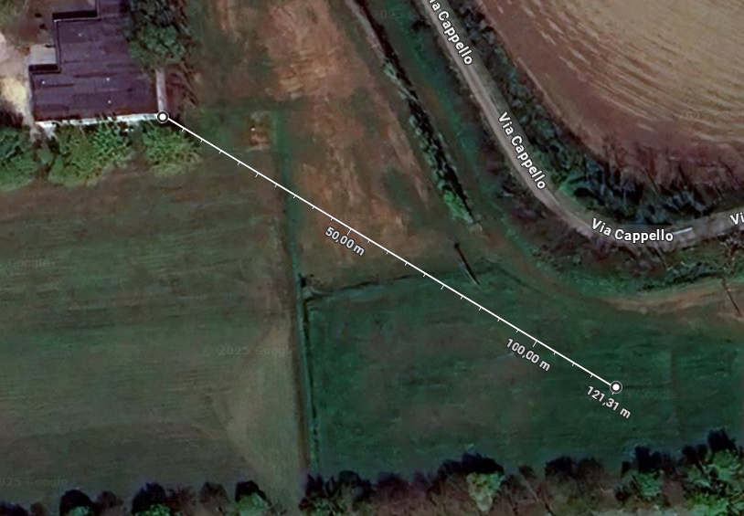
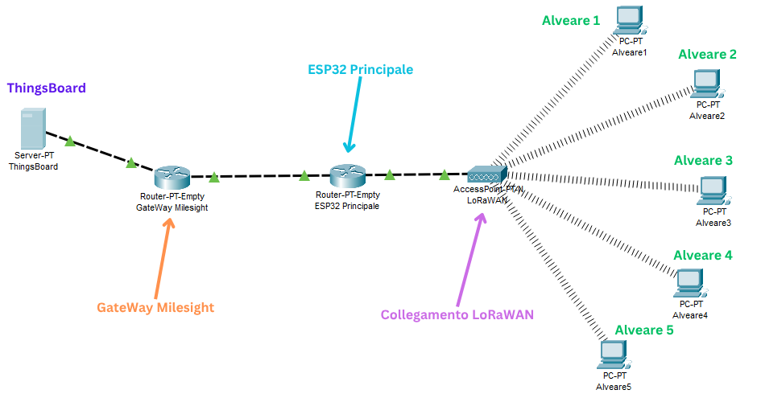

# Analisi dei requisiti
Questo documento vuole essere una versione aggiornata dell'analisi dei requisiti del progetto già iniziato. 
Lo scopo è quello di ristabilire i nuovi requisiti in modo tale da avere dei punti precisi sui quali sviluppare il lavoro dei prossimi mesi.

## Descrizione progetto
Il progetto viene realizzato in collaborazione con l'ITAS di Rovigo.
Lo scopo è quello di raccogliere una serie di dati dalle arnie con una certa scansione oraria e poter successivamente poterli visualizzare attraverso interfaccia grafica.

Tali dati potranno poi essere utilizzati per determinare quando raccogliere il miele o segnalare eventuali informazioni riguardo lo stato delle singole arnie.

### Dati da misurare
I dati da misurare all'interno di ogni arnia sono i seguenti
- **TEMPERATURA**
- **UMIDITÀ**
- **RUMORE** per misurare l'attività delle api

Tali dati dovranno essere rilevati seguendo una specifica scansione oraria che potrà essere stabilita in seguito.

### Luogo
*Posizione dell'alveare all'interno dell'ITA*

Com'è possibile vedere, il luogo in cui l'alveare sarà collocato è in un campo aperto, che potrebbe presentare ostacoli come vento o passaggio di persone durante il suo periodo di lavoro. La distanza dal punto della scuola più vicino è a 100m. 
**Nel punto verranno installate n. 5 arnie**, quindi ci dovranno essere 5 apparati di misurazione che comunicheranno tutti i dati raccolti.

## Scelte effettuate
Durante i primi mesi sono state già definite alcune scelte per la continuazione del progetto. Qui verranno solo esposte, di seguito verranno analizzate le [problematiche](#problematiche-riscontrate).

### Schema di collegamento
*Esempio di collegamento tra i vari componenti di rete*

**NOTA BENE** *Alcuni collegamenti dello schema, come i componenti utilizzati in Packet Tracer sono a scopo esemplificativo. La nomenclatura, inoltre, non corrisponde perfettamente con i dispositivi e la tecnologia attualmente adottata. Seguire le indicazioni seguenti per conoscere gli ultimi dispositivi e la tecnologia adottata.*

La rete adottata per la comunicazione dei dati delle singole arnie è composta dai seguenti elementi:
1. *SCHEDA ALVEARE* presente per ogni arnia ai quali sono collegati i sensori. Dalla scheda partono i dati relativi ai segnali rilevati. 
2. *GATEWAY ALVEARI* accoglie tutti i dati degli alveari e li trasmette all'antenna più vicina. 
3. *SISTEMA DI RICEZIONE* costituito da un'antenna posizionata all'esterno dell'edificio più vicino all'agrario. Comunicherà al server i dati raccolti. 
4. *SERVER* raccoglie i dati che verranno successivamente elaborati. 

### Schede alveare
La scheda pensata per la rilevazione dei dati dell'alveare è l'**Arduino Mega**, di cui la scuola ne ha un ampio numero. L'Arduino Mega è programmabile attraverso l'IDE di Arduino, è molto semplice da configurare e lavora alla stessa tensione da utilizzare per i sensori. All'Arduino verrà poi collegato un modulo ESP32 per la comunicazione con il gateway.

*Inizialmente si era pensato all'Arduino PRO, ma risulta essere più difficile da configurare e necessita una tensione di 24V.*

### Dispositivi sistema sensoristico alveare
Di seguito viene riportato l'elenco di sensori scelti per la misurazione dei vari dati nelle singole arnie:
- [**DHT22**](https://amzn.eu/d/d1KN32y) sensore in grado di misurare temperatura e umidità. Facilmente programmabile con Arduino e in grado di resistere a escursioni termiche elevate.
- [**Cella di carico**](https://www.tinkerforge.com/en/shop/load-cell-100kg-czl601.html) che verrà posizionata all'interno dell'arnia per misurare il peso dell'alveare. La misurazione funziona anche ad alveare inclinato.
- [**Microfono omnidirezionale**](https://www.amazon.it/Fasizi-Microfono-omnidirezionale-Interfaccia-Digitale/dp/B09Z2CL4PF?source=ps-sl-shoppingads-lpcontext&ref_=fplfs&psc=1&smid=A3LA1TDA4Q3SUA) garantisce alta qualità del suono e facile configurazione.

Per l'alimentazione del sistema è stato pensato a:
- [**Batteria AGM**](https://www.leroymerlin.it/prodotti/green-cell-agm04-batteria-ups-acido-piombo-vrla-12-v-7-ah-91021332.html?Megaboost=&utm_source=chatgpt.com) Batteria che resiste a inclinazioni e vibrazioni. Offre maggiore autonomia di utilizzo. 
- [**Pannello solare**](https://www.amazon.it/DEWIN-Policristallino-Caricabatterie-Passerella-Connettore/dp/B0CLGFPZ48?source=ps-sl-shoppingads-lpcontext&ref_=fplfs&psc=1&smid=AY539Q835IRBX&utm_source=chatgpt.com) Prodotto di alta efficienza, leggero e portatile.

### Gateway alveare
Per il gateway delle arnie si è pensato ad un **Raspberry Pi**. Durante i primi mesi è stato già configurato con Raspbian come OS. A tale dispositivo verrà collegato un modulo LoRa per la trasmissione dei dati. 

Un Raspberry verrà utilizzato anche dopo la ricezione dei dati dall'antenna collegata all'ITA, in modo tale da poter inviare i dati su un server. 

### Configurazione server
Per la configurazione del server si è deciso di utilizzare **ThingsBoard**, che implementa un database per la raccolta dati e un'interfaccia grafica. Con il sistema di account e la personalizzazione, consente di mostrare, raccogliere e gestire la visualizzazione dei dati anche lato cliente.

## Problematiche riscontrate
### Analisi dei problemi
Durante lo sviluppo del progetto estivo e le riunioni svolte al ritorno a scuola sono emersi vari problemi relativi al progetto, in particolare:
1. **Assenza di Wi-Fi** non è possibile utilizzare la tecnologia Wi-Fi per la comunicazione delle informazioni. Le api infatti possono risentire delle frequenze emanate da tale comunicazione. Anche la proposta di collegare in modo cablato i vari componenti del sistema dell'alveare è stata finora bocciata.
2. **Impossiibilità dell'utilizzo del LoRaWAN** alternativa al Wi-Fi era proprio il protocollo LoRaWAN. Questa comunicazione sfrutta frequenze più basse e opera al livello 3 della pila ISO-OSI. Tuttavia per implementare il LoraWAN occorre che uno dei due dispositivi di comunicazione sia impostato in modalità server, ma ciò non risulta possibile.
L'unica soluzione finora trovata è l'utilizzo del solo protocollo LoRa, che però ha lo svantaggio di essere soggetto a collisioni ed essere unidirezionale.
3. **Trasmissione dei dati** oltre ad una frequenza eccessiva, le api potrebbero risentire una comunicazione sempre attiva tra i dispositivi. Per questo è stato chiesto di comunicare i dati utilizzando protocolli a onde radio solo 3 volte al giorno.
Altro problema da tenere in considerazione sono i dati corrotti che potrebbero essere trasmessi, dovuti alle interferenze ambientali. 
4. **Alimentazione dell'arnia** il sistema di sensori collegato ad ogni arnia dovrà essere alimentato da una batteria collegato ad un pannello solare. Tuttavia la quantità di energia raccolta potrebbe non essere sufficiente per mantenere sempre attivo il sistema di sensori o in caso di maltempo, soprattutto nella stagione invernale. 
5. **Condizioni ambientali** oltre all'alimentazione, il maltempo e la situazione ambientale potrebbero influire sul sietma di sensori. Occorre quindi scegliere sensori in grado di resistere a tali condizioni e poter sviluppare una scatola che possa proteggere l'apparato.
6. **Rilevazione del rumore** il rumore rilevato all'interno dell'alveare indica lo stato di attività delle api, assieme alla frequenza. Tuttavia tali dati necessitano di un campionamento, oltre che ad essere raccolti per un certo intervallo di tempo. Ciò vorrebbe dire impiegare interamente per quella durata la scheda a cui sono collegati i sensori e un consumo di energia da tenere in considerazione. Inoltre occorre comprendere se effettivamente il rumore è proveniente dalle api o se è compromesso da attività esterne.
7. **Programmazione antenna** l'antenna di ricezione delle informazioni inviate dagli alveari sfrutta software proprietario, quindi risulta più difficile da utilizzare per l'attuale progetto.

### Possibili soluzioni
A questi problemi sono state avanzate delle possibili soluzioni, tuttora però da sviluppare:
1. **Utilizzo del LoRa** nonostante i problemi precedentemente elencati. L'idea è quella di costruire un protocollo non troppo complesso al di sopra in modo tale da poter garantire una comunicazione senza collisioni.
2. **Ripetizione nell'invio dei dati** Siccome il numero di interazioni tra i dispositivi comunicanti con onde radio è basso, una soluzione potrebbe essere la loro memorizzazione. Facendo così tali dati verranno raccolti e trasmessi sono nei momenti in cui è consentito. Ogni singolo dato, inoltre, potrà essere ripetuto più volte così da ridurre eventuali errori di corruzione dei dati.
3. **Sviluppo della scatola di sensori** che verrà posizionata all'esterno dell'arnia. Tale soluzione consente un buon grado di protezione e meno interferenza possibile con le api. 
4. **Scheda dedicata al rilevamento del rumore** ***(PROPOSTA DA VERIFICARE)***. Questa scheda dedicata si attiverà solo al superamento di un segnale di soglia. Da lì parte il campionamento del segnale in modo da poter rilevare rumore e frequenza e consentire al resto del sistema di poter operare indipendentemente. Alla fine tali dati verranno comunicati alla scheda a cui sono collegati il resto dei sensori.

## Requisiti attuali
Alla luce della situazione attuale e dei relativi problemi, ecco i requisiti da soddisfare durante la continuazione del progetto:

### Sistema sensoristico
1. Finire la progettazione della scatola contenente la scheda con i collegamenti ai sensori. 
2. Testare il sensore DHT22
3. Testare la cella di carico 
4. Testare il microfono, con la relativa questione di accensione, spegnimento e campionamento
5. Scrittura del codice della scheda per la rilevazione dati.
6. Gestire l'invio ripetitivo dei dati e il loro salvataggio temporaneo. 

*Per i test è stato proposto di sfruttare i kit di Arduino con breadboard e Arduino Mega, in modo tale da controllare la piena funzionalità dei sensori*.

### Gateway alveari
1. Progettare l'esatto scambio di informazioni con tutti i possibili messaggi tra alveari e server.
2. Implementare il codice di comunicazione all'interno del gateway. 

### Protocollo di comunicazione
1. Finire la progettazione del protocollo da aggiungere al LoRa. 
2. Scrivere un primo codice di prova e testare il funzionamento. 
3. Implementare tale protocollo nelle schede degli alveari e nei Raspberry. 

### Ricevitore
1. Verificare la validità dell'antenna attuale per la ricezione dei dati.
2. Testare una possibile ricezione dei dati. 
3. Testare l'invio dei dati verso il server.
4. Scrivere il codice definitivo.

### Server
1. Configurare il server con ThingsBoard
2. Configurare il database
3. Configurare la gestione degli account
4. Configurare l'interfaccia grafica di prova per l'output dei risultati

**N.B.** *Per l'output dei dati è stato pensato di utilizzare un interfaccia grafica dedicata e non quella di default del server ThingsBoard. Tale interfaccia ha lo scopo di essere maggiormente accessibile da più persone e facilmente collegabile al sito della scuola e ad altri progetti di cui la scuola si sta occupando.*

## Link utili
- [Documentazione ThingsBoard](https://thingsboard.io/docs/)
- [Documentazione LoRa](https://lora.readthedocs.io/en/latest/)
- [Relazione estiva progettp](https://docs.google.com/document/d/1Dwv33JR1j2aQpMVEqqzAZ313RDTC_d7JLzsLLFGhavA/edit?usp=sharing)