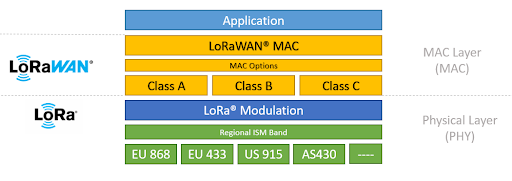

# Protocollo di comunicazione LoRa

La comunicazione con le arnie richiede un protocollo wireless, dati i requisiti del cliente. Le api sono sensibili a certe frequenze radio prodotte, quindi è necessario comunicare a una frequenza che non vada a disturbare il loro lavoro.  

La comunicazione avviene tra un Raspberry Pi con un LoRa HAT montato, che permette di comunicare con un microcontrollore basato su ESP32, a sua volta dotato di un chip LoRa, per l’invio delle letture eseguite attraverso i sensori ad esso collegati verso il Raspberry. Il Raspberry funge da gateway, di conseguenza si occupa di effettuare un instradamento dei dati verso un server ThingsBoard inserito all’interno della rete LAN, al quale accede per salvare le letture all’interno di un database e visualizzarle in una dashboard.  

Ciò impedisce la normale comunicazione attraverso un protocollo dello stack TCP/IP come il Wi-Fi 802.11. È quindi necessaria una comunicazione con parametri specifici, ove sia dimostrato che non vadano a influire con la corretta operatività delle arnie. Seguono i parametri di frequenza e potenza radio utilizzati da LoRa in Unione Europea.

## Parametri di comunicazione del protocollo LoRa nell’UE

Tutte le informazioni qui mostrate sono state ricavate dalle specifiche regionali di LoRa, a meno che non sia inserito un link di una sorgente diversa:  
[https://resources.lora-alliance.org/technical-specifications/rp002-1-0-4-regional-parameters](https://resources.lora-alliance.org/technical-specifications/ts001-1-0-4-lorawan-l2-1-0-4-specification)

([Riga 1266-1277, pagina 40, Specifiche generali del protocollo](https://resources.lora-alliance.org/technical-specifications/ts001-1-0-4-lorawan-l2-1-0-4-specification) - Il modulo non può in alcun caso superare i 36 dBm o 3.98 W, ma questi sono solo i valori massimi supportati dal modulo. Seguono le specifiche massime in Europa.)

(Sezione 2.4.2, Pagina 32, Tabella riga 572)

Il modulo utilizza la banda EU863-870 che ha le frequenze specificate dalla tabella: **868.10 MHz - 868.625 MHz**  
in base al canale che viene utilizzato per la comunicazione.

(Sezione 2.4.3, Pagina 33, Paragrafo Riga 595)

La potenza massima trasmessa in Europa deve essere di **+16 dBm (39.8 mW)**, secondo la banda europea EU863-870 (indicata anche nelle [specifiche regionali di questa banda](https://www.thethingsnetwork.org/docs/lorawan/regional-parameters/eu868/) sotto la sezione "*Maximum EIRP / ERP*").

**ERP**: *Effective Radiated Power*, ovvero la potenza effettiva irradiata da un'antenna tenendo conto del suo guadagno rispetto a un dipolo standard. EIRP differisce da ERP perché il guadagno dell'antenna viene misurato rispetto a un'antenna isotropa.

# Protocollo ideale

Per soddisfare questi requisiti, il protocollo ideale è il LoRaWAN, ovvero un'integrazione layer 3 del protocollo LoRa, che invece si colloca al layer 2. Seguono le differenze fra i due e i problemi riscontrati relativi ad essi.

### Differenza tra LoRa e LoRaWAN

*Il protocollo LoRa è solamente un protocollo layer fisico della pila ISO/OSI; di conseguenza, gestisce solamente un broadcast via radio verso gli altri dispositivi compatibili con lo standard LoRa nelle vicinanze. Non gestisce alcuna tecnica a contesa per connessioni multiple, né connessioni o criptazione dei dati.* 

*Di conseguenza, se viene acquistato un modulo che supporta **solamente** il protocollo LoRa, e non LoRaWAN, non sarà possibile gestire una serie di funzionalità tra cui le seguenti:*  

- *Connessioni multiple attraverso un singolo dispositivo*  
- *Criptazione dei dati attraverso una chiave di applicazione*  
- *Classi di lavoro per diminuire la potenza utilizzata compromettendo la latenza*  

*Quando si stabilisce una connessione di un dispositivo con un gateway LoRaWAN, è quindi*  

*necessario specificare i seguenti parametri:*  

- ***EUI Dispositivo***: identificativo del dispositivo a cui si deve connettere il gateway  
- ***EUI Applicazione***: identificativo dell’applicazione utilizzata; su alcuni gateway, come il Milesight, basta impostarlo a tutti zeri  
- ***Chiave Applicazione***: chiave di criptazione utilizzata per cifrare il contenuto dei pacchetti  

*Nel caso in cui la connessione non venga eseguita attraverso OTAA (Over The Air Activation), che*  

*è un handshake che permette la trasmissione di ulteriori chiavi di comunicazione all’attivazione, viene utilizzata invece ABP (Activation By Personalization). Quest’ultima tecnica di connessione è meno sicura e richiede l’inserimento manuale di alcune chiavi ulteriori. Generalmente, però, è più altamente supportata rispetto alla più sicura OTAA. La maggior parte degli errori riscontrati durante l’utilizzo di schede di sviluppo LoRa sono stati provocati dall’OTAA.*

## Differenze fra chip

La differenza fra i due protocolli è stata evidenziata perché un problema riscontrato durante lo sviluppo è dato dal mancato supporto di un chip che integri LoRaWAN lato server, a basso costo e disponibile per le piattaforme richieste.

La comunicazione fra il Raspberry Pi e l’ESP32 avviene facendo uso di un chip SX1262. Malgrado questo supporti la comunicazione LoRaWAN solo come client (e non come server), da quanto risulta da varie fonti online, la comunicazione tra il chip ESP32 e un gateway Milesight LoRaWAN server è sempre fallita nonostante i vari tentativi, seguendo i passaggi riferiti dal manuale.

In ogni caso, per la corretta comunicazione tramite LoRaWAN, il gateway deve essere composto da un chip della serie SX123x, i quali non sono prodotti in massa su LoRaHAT per Raspberry Pi. Non è nemmeno possibile utilizzare un gateway commerciale come quello della Milesight utilizzato per le prove, perché non ci permetterebbe di gestire manualmente l’occupazione della banda radio che, data l’interferenza con le arnie, deve essere controllata.

## Scelta del chip

Il chip per la comunicazione è stato scelto sulla base del supporto di librerie. Il chip SX1262 è supportato dalla libreria [RadioLib](https://github.com/jgromes/RadioLib), che a sua volta supporta contemporaneamente sia la piattaforma Arduino che la piattaforma Raspberry Pi, permettendo di scrivere codice portabile su entrambe le piattaforme con modifiche minori.

# Creazione del protocollo di comunicazione

Date le problematiche citate in questo documento, è sembrata plausibile la creazione di un protocollo che permetta la comunicazione con una certa affidabilità, facendo solamente uso di radio LoRa.

Segue una descrizione delle caratteristiche del protocollo.

# Descrizione protocollo

Il protocollo introduce le seguenti funzionalità alla comunicazione corrente:

- Indirizzamento  
- Messaggi di controllo  
- Abilitazione del CRC sul protocollo LoRa sottostante  

Un pacchetto inviato dal protocollo contiene la sorgente e la destinazione del messaggio. Il dispositivo ricevente viene identificato con una stringa di testo che deve combaciare con quella contenuta nella destinazione del pacchetto ricevuto, altrimenti il pacchetto viene ignorato. La stringa di testo non ha un limite di lunghezza al momento.  

Nell’header, in seguito alla sezione contenente sorgente e destinazione del pacchetto, segue un valore numerico contenente il messaggio di controllo, che può essere una `REQUEST`, una `REPLY` o un `PING`. Al momento il protocollo non ha comportamenti differenti in base al messaggio di controllo inviato; esso può essere direttamente specificato e letto dall’utente. Il protocollo inoltre si occupa di abilitare la codifica CRC nel LoRa sottostante per garantire una maggiore accuratezza nel trasferimento delle informazioni.

## Utilizzo della libreria

- **Costruttore**  

  Il costruttore della libreria permette la creazione dell’identificatore del dispositivo:  
  `NiagaraPi("RASPI", true);`  

  Il secondo parametro è opzionale e determina se mostrare i messaggi di log nel terminale durante l’inizializzazione del modulo radio.

- **Invio dati**  

  L’invio dei dati avviene attraverso l’utilizzo del seguente metodo:  
  `Niagara_Ret NiagaraPi::send(std::string destination, Niagara_Control control, std::string message);`

  Si specifica come prima stringa la destinazione del pacchetto, ovvero l’identificativo che il dispositivo ricevente ha inserito nel costruttore della libreria. Successivamente si specifica il messaggio di controllo, contenuto nell’enumeratore `Niagara_Control`, e infine viene specificata una stringa con il messaggio vero e proprio.

  Nel caso ci sia stato un errore durante l’invio dei dati, viene ritornato un valore diverso da `NIAGARA_OK` contenuto nell'enumeratore `Niagara_Ret`.

- **Ricezione dati**  

  La ricezione dei dati avviene attraverso il metodo bloccante seguente:  
  `Niagara_Ret NiagaraPi::receive(std::string* source, Niagara_Control* control_output, std::string* message_output);`

  Richiede un puntatore a una stringa che verrà riempita con l’identificatore della sorgente che ha inviato il messaggio. Inoltre, un altro puntatore a un tipo `Niagara_Control` che riempirà il valore di controllo contenuto nel messaggio ricevuto e infine un’ultima stringa che viene popolata con il messaggio ricevuto effettivo.

  Nel caso ci sia stato un errore durante la ricezione dei dati, viene ritornato un valore diverso da `NIAGARA_OK` contenuto nell'enumeratore `Niagara_Ret`.

## Miglioramenti futuri

Si prevede di integrare il protocollo con le seguenti funzionalità:

- Handshake tra i dispositivi e gestione (benché minima) delle sessioni a layer 4, con aggiunta di ritrasmissione dei pacchetti  
- Messaggi di controllo utilizzati effettivamente per questo handshake  
- Specificare un formato per le stringhe di indirizzamento  
- Fare in modo che la funzione di invio dati costruisca direttamente il JSON da inviare nel corpo del messaggio destinato al gateway, in modo da passare direttamente le letture dei sensori e lasciare che essa si occupi della loro formattazione  

# Specifiche protocollo
## Sistema di comunicazione
Ogni pacchetto ha al suo interno i seguenti dati:
- **identificativo mittente**
- **identificativo destinatario**
- **messaggio di controllo** valore che indica il tipo di pacchetto che viene inviato (sincronizzazione, ricezione, errore ecc.)
- **payload** contenuto del pacchetto con dati da trasmettere

Per la comunicazione di ogni informazione verrà effettuata l'operazione di sincronizzazione, acknowledgenment e conferma dell'acknowledgement. Nella fase di sincronizzazione viene inviato anche il payload, mentre nell'acknowledgement l'hash del messaggio precedente. Se ciò non combacia viene mandato un messaggio di errore e viene effettuata la ritrasmissione del pacchetto. 

**N.B.** Ogni pacchetto con lora ha una dimensione massima di 255 byte, quindi potranno essere inviati poche telemetrie alla volta, oppure gestire la frammentazione di pacchetti. 

## Funzioni per la comunicazione
Le funzioni che la libreria dovrebbe prevedere sono:

- `connect()` per il dispositivo che instaura una connessione ed eseguire l'handshake a tre vie 
- `listen()` che blocca il dispositivo finché non riceve una richiesta di sincronizzazione e poi continua con l'handshake a tre vie
- `end()` utilizzato per terminare la connessione

## Tipologie di comunicazione
Ogni messaggio inviato viene associato un messaggio di controllo che indica il tipo di informazione che il dispositivo vuole trasmettere. 
Questi valori appartengono ad un enumeatore della libreria `niagara.h` e sono:
- `HANSHAKE_SYN` valore di controllo inviato all'inizio dell'handshake in fase di connessione
- `HANDSHAKE_ACK` valore che indica la conferma del dispositivo ricevente all'interno del processo di handshake
- `HANSHAKE ERROR` invio errore se il pacchetto non è stato ricevuto perchè gli hash dei pacchetti non combaciano
- `TIME_SYNC` invio del tempo (millisecondi o data) da parte di uno dei dispositivi per potersi sincronizzare. 
- `END` fine della connessione tra i due dispositivi