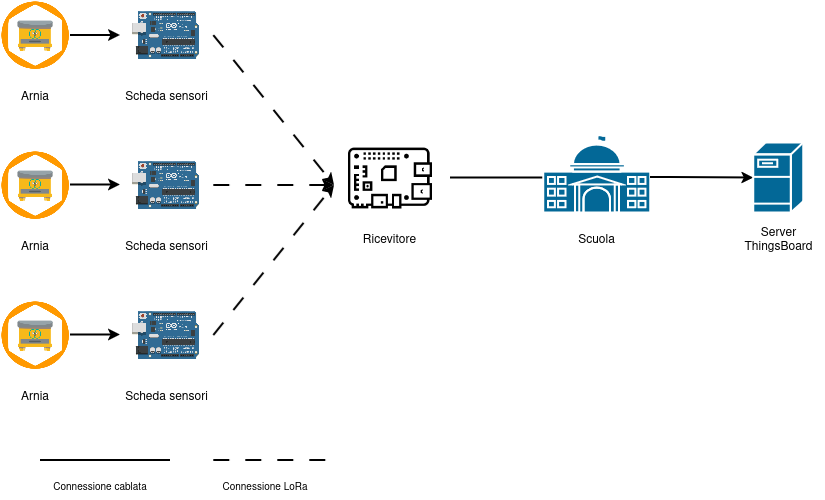

# Analisi funzionale
## Schema di comportamento

Il sistema per la raccolta dati dell'alveare deve seguire il seguente schema di funzionamento:
1. **SCHEDA ALVEARE** deve raccogliere le varie misurazioni con una frequenza che rispetta le esigenze di monitoraggio. In seguito attraverso protocollo LoRa dovrà inviare le informazioni al gateway secondo un intervallo predefinito. Tempi di misurazione e di invio potrebbero non coincidere tra loro, così come ogni misurazione potrebbe non necessitare della stessa frequenza.
3. **RICEVITORE** riceve i dati dal gateway e li invia immediatamente al server ThingsBoard per il relativo salvataggio.
4. **SCHEDULER** si occupa dell'invio di richieste periodiche al server per il monitoraggio delle telemetrie dei diversi dispositivi. Tale funzione potrebbe essere assolta dallo stesso dispositivo che compie la funzione del ricevitore.
5. **SERVER** il server deve essere configurato con ThingsBoard e ricevere correttamente i dati. Deve inoltre prevedere la ricevuta di alcune richieste da dispositivi per eseguire controlli sui dati e generare eventuali allarmi/informazioni. 

## Funzionamento singoli componenti
Di seguito viene riportato nel dettaglio il funzionamento specifico dei vari componenti:

### Scheda alveare
La scheda alveare ha il compito di raccogliere le misurazioni dei vari sensori secondo un intervallo stabilito dal committente. 
Tale frequenza di misurazione potrebbe variare da grandezza a grandezza da misurare, quindi si suggerisce per ogni misurazione di mettere gli orari per ogni giornata, presupponendo che non andranno a variare di giorno in giorno. 

Inoltre la scheda deve occuparsi dell'invio dati secondo una scansione oraria prevista (probabilmente tre volte al giorno) e deve essere quindi pronto ad attivarsi ogni qualvolta venga richiesto. 

Ne consegue che l'alveare debba poter archiviare i dati misurati tra un invio e l'altro in modo univoco e possibilmente ripetere l'invio della stessa misurazione più volte in più momenti della giornata. Tale soluzione contribuirebbe ad una maggiore tolleranza agli errori di trasmissione, specialmente con una comunicazione via onde radio. 

### Ricevitore
Il ricevitore sarà posto nella parte dell'edifico più vicina in linea d'aria all'alveare e libera da eventuali ostacoli intermeedi (alberi, forte vento ecc.).
Il dispositivo effettuerà la ricezione dei dati dal gateway e farà una manipolazione dei dati in modo da ricostruire eventuali pacchetti frammentati e suddividerli per dispositivo. 

Il ricevitore invierà quindi i dati manipolati al server ThingsBoard senza attendere una scansione oraria per consentire l'archivizione delle telemetrie.

### Server ThingsBoard
Stando alla documentazione precedente è possibile salvare telemetrie per ogni dispositivo utilizzando il sever ThingsBoard.
Tuttavia, oltre a raccogliere semplicemente i dati, il sistema dell'alveare dovrebbe poter:
- segnalare lo stato dell'alveare (come quando è ora di raccogliere il miele)
- segnalare possibili anomalia del sistema di sensori
- controllare la validità del dato trasmesso

Per questo occorrerà interagire con le Rule Engine e impostare delle Rule chains che possano controllare queste condizioni e segnalarle. 

L'obiettivo è quello di mostrare questi messaggi come allarmi in modo che possano essere letti e mostrati anche nel frontend previsto per il progetto dell'alveare. 

#### Asset comune
Tutti i dispositivi collegati alle arnie dovranno essere raggruppati in un asset comune. 
Potrebbe essere utile infatti poter confrontare dati tra arnie diverse e notare la presenza di possibili anomalie.

#### Rule chains da creare
Per far sì che il sistema sia completo e possa segnalare informazioni o problemi del sistema occorre che siano implementate le seguenti Rule Chain:
- **controllo registrazione dato** se il dispositivo indicato non è stato trovato nel server occorre inserire un allarme di errore.
- **controllo dato** una volta passato il controllo del dispositivo occorre che il dato venga controllato, ossia che la grandezza da misurare sia già stata registrata e che il dato non sia fuori dal range previsto, possibile segnale di un'anomalia dei sensori o di un errore nella trasmissione del dato. In base a quello sarà possibile scegliere se o meno archiviare la telemetria o sostituirla con una già presente. In quel caso è possibile segnalare la cosa con un semplice allarme di rilevanza minore.
- **controllo dispositivo** deve essere controllato che il dispositivo abbia effettivamente ricevuto misurazioni nell'ultimo intervallo di tempo e che gli ultimi dati raccolti non sforino con la media dei dispositivi vicini. Per questo tipo di dato occorrerebbe inserire un warning. 
- **controllo alveare** per il controllo dell'alveare è possibile inserire un allarme che indica alcune informazioni relative all'alveare. Ad esempio con un warning si potrebbe indicare il momento in cui raccogliere il miele.

### Scheduler
Lo scheduler viene realizzato in funzione del server ThingsBoard in modo da inviare richieste RPC periodiche al server per l'esecuzione dei controlli sopra citati. 
La frequenza dei controlli viene stabilita in fase di progetto (probabilmente 1 volta al giorno).

Anche per lo scheduler risulterebbe opportuno salvare lo stato degli invii in un file di log, in modo da tenerne traccia per futuri controlli e manutenzioni.

## Informazioni aggiuntive
Per la realizzazione di tale sistema occorre una conoscenza del funzionamento della piattaforma ThingsBoard e la realizzazione di un protocollo per lo scambio di informazioni. 

Durante la fase di ricerca sono state redatte documentazioni riguardo questi due argomenti contenenti le nozioni di base e gli aspetti di interesse per il progetto. 

Per ulteriori approfondimenti visitare quindi [ThingsBoard](./ThingsBoard.md) e [Protocollo Lora](./protocollo-LoRa.md).

## Aggiornamento conclusivo
Per motivi di semplicità, si è pensato che la scheda ESP32 possa inviare i dati senza ricevere una richiesta del ricevitore. 
Non sarà inoltre necessario effettuare l'invio della stessa misurazione più volte, dal momento che il protocollo implementa l'Acknowledgement per i pacchetti ricevuti e il CRC per il controllo dei dati. 

**Queste modifiche saranno effettive e varranno per le varie documentazioni realizzate.**